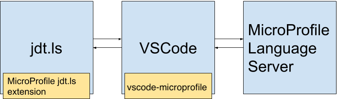
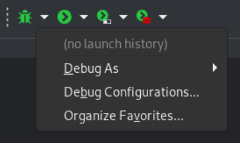
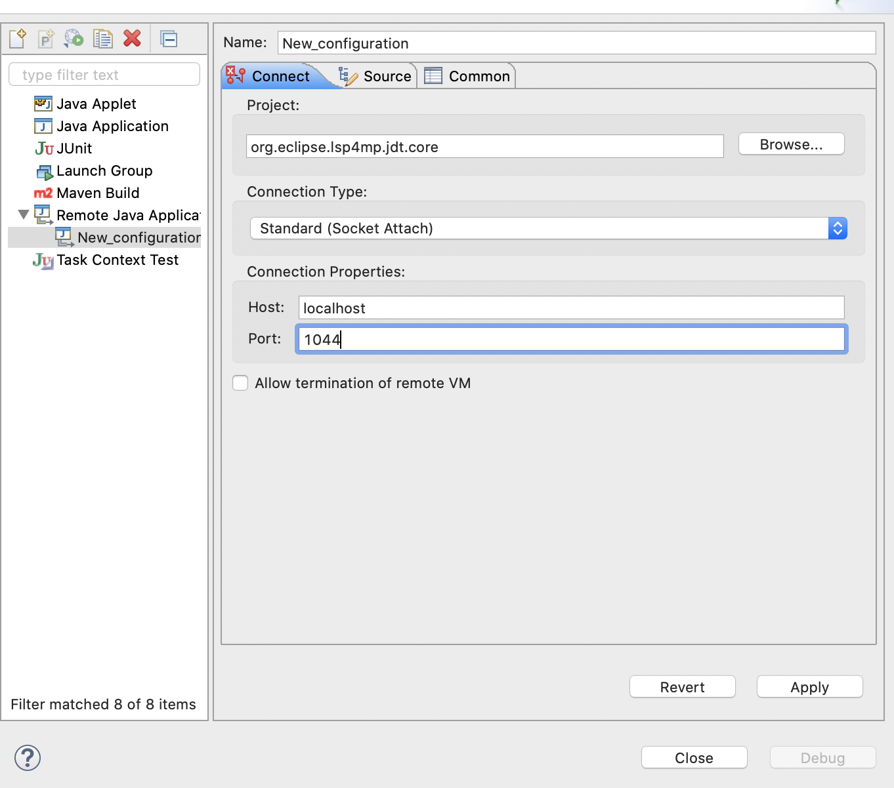

# Contribution Guide

Contributions are extremely welcome, no matter how big or small.
If you have any questions or suggestions we are happy to hear them.

# Table of Contents
1. [Project Structure](#project-structure)
2. [Implementing language features for `microprofile-config.properties`](#implementing-language-features-for-microprofile-configproperties)
3. [Implementing language features for Java files](#implementing-language-features-for-java-files)
4. [Development Setup](#development-setup)
    1. [Installation Prerequisites](#installation-prerequisites)
    2. [Setup](#setup)
    3. [Running vscode-microprofile](#running-vscode-microprofile)
    4. [Testing vscode-microprofile](#testing-vscode-microprofile)
5. [Debugging](#debugging)
    1. [Debugging the MicroProfile language server](#debugging-the-microprofile-language-server)
    2. [Debugging the MicroProfile jdt.ls extension](#debugging-the-microprofile-jdtls-extension)

## Project Structure
For vscode-microprofile to work, it relies on the
[MicroProfile language server](https://github.com/eclipse/lsp4mp/tree/master/microprofile.ls)
and the 
[MicroProfile jdt.ls extension](https://github.com/eclipse/lsp4mp/tree/master/microprofile.jdt). 
The MicroProfile language server is responsible for providing
[LSP language features](https://microsoft.github.io/language-server-protocol/specification)
to VSCode, while the MicroProfile jdt.ls extension is responsible
for functionalities like listening
to Java classpath changes and generating config setting metadata for
the `microprofile-config.properties` file.
The reason why 
[vscode-java](https://github.com/redhat-developer/vscode-java) 
is required for vscode-microprofile to work, is because vscode-java
starts the [jdt.ls](https://github.com/eclipse/eclipse.jdt.ls)
language server, which is required to run the MicroProfile jdt.ls extension.

**Note**: The MicroProfile language server provides language features for both `microprofile-config.properties` and `*.java` files.

  
The image above represents communication between the three components. 
As the image implies, the MicroProfile language server cannot directly 
communicate with the MicroProfile jdt.ls extension and vice-versa. They must 
communicate via vscode-microprofile.  

Here is an example of how the components work together for
`microprofile-config.properties` completion:

**Step 1.** A MicroProfile project is opened in VSCode, and completion has been 
invoked inside the `microprofile-config.properties` file. VSCode sends a
`textDocument/completion` request to the MicroProfile language server.  

**Step 2.** MicroProfile language server checks its cache if completion options
exist.  
* If the cache holds completion options, the MicroProfile language server sends them to VSCode 
as the response to the `textDocument/completion` request.
Communication is complete, and does not proceed to Step 3 
and onwards.
* If completion options are not cached, the MicroProfile language server sends a 
custom request, `microprofile/projectInfo` to vscode-microprofile.  
Proceed to Step 3.  

**Step 3.** vscode-microprofile receives the `microprofile/projectInfo` request,
and delegates it to the MicroProfile jdt.ls extension.  

**Step 4.** The MicroProfile jdt.ls extension receives the command, determines
[project information](https://github.com/eclipse/lsp4mp/tree/master/microprofile.jdt/org.eclipse.lsp4mp.jdt.core/src/main/java/org/eclipse/lsp4mp/commons/MicroProfileProjectInfo.java)
(project URI, configuration properties, hints etc.)
about the currently opened MicroProfile project and returns
the information to vscode-microprofile. The project information is then sent to
the MicroProfile language server

**Step 5.** vscode-microprofile receives the project information and sends it
to the MicroProfile language server.  

**Step 6.** MicroProfile language server receives the information, adds it 
to its cache, and returns the completion options stored in the 
project information as the response to the `textDocument/completion`
request.

## Implementing language features for `microprofile-config.properties`
When a `microprofile-config.properties` file sends a request (e.g. textDocument/completion) to the
MicroProfile language server, the requests are accepted in
[ApplicationPropertiesTextDocumentService#completion](https://github.com/eclipse/lsp4mp/tree/master/microprofile.ls/org.eclipse.lsp4mp.ls/src/main/java/org/eclipse/lsp4mp/ls/ApplicationPropertiesTextDocumentService.java#L150).
This class receives LSP requests for `microprofile-config.properties` files.

Properties collected by the MicroProfile jdt.ls extension are cached to keep response times
fast.
Collecting properties will not be done unless absolutely necessary
(ie, if cache doesn't exist, if project dependencies change).

When the completion is triggered,
the MicroProfile LS checks the properties cache for the given `microprofile-config.properties` file.
If the cache does not exist, it calls the `microprofile/projectInfo` request to call the JDT LS Extension [projectInfo delegate command handler](https://github.com/eclipse/lsp4mp/tree/master/microprofile.jdt/org.eclipse.lsp4mp.jdt.core/src/main/java/org/eclipse/lsp4mp/jdt/internal/core/ls/MicroProfileDelegateCommandHandler.java#L71) which
uses the
[properties manager](https://github.com/eclipse/lsp4mp/tree/master/microprofile.jdt/org.eclipse.lsp4mp.jdt.core/src/main/java/org/eclipse/lsp4mp/jdt/core/PropertiesManager.java)
that collects MicroProfile properties for the given Java project.

This manager is extensible by the
`org.eclipse.lsp4mp.jdt.core.propertiesProviders`
[extension point](https://github.com/eclipse/lsp4mp/blob/master/microprofile.jdt/org.eclipse.lsp4mp.jdt.core/plugin.xml#L5):

 * [org.eclipse.lsp4mp.jdt.core](https://github.com/eclipse/lsp4mp/tree/master/microprofile.jdt/org.eclipse.lsp4mp.jdt.core/plugin.xml#L49-L52) defines properties provider for MicroProfile.

Here are some providers for MicroProfile projects and the annotation(s) they scan for:

| Class | Annotations |
|-------|-------------|
| [MicroProfileConfigPropertyProvider](https://github.com/eclipse/lsp4mp/blob/master/microprofile.jdt/org.eclipse.lsp4mp.jdt.core/src/main/java/org/eclipse/lsp4mp/jdt/internal/config/properties/MicroProfileConfigPropertyProvider.java) | org.eclipse.microprofile.config.inject.ConfigProperty |
| [MicroProfileRegisterRestClientProvider](https://github.com/eclipse/lsp4mp/blob/master/microprofile.jdt/org.eclipse.lsp4mp.jdt.core/src/main/java/org/eclipse/lsp4mp/jdt/internal/restclient/properties/MicroProfileRegisterRestClientProvider.java) | org.eclipse.microprofile.rest.client.inject.RegisterRestClient |

The microprofile.jdt can also be extended to provide additional property providers.

* For example: [com.redhat.microprofile.jdt.quarkus](https://github.com/redhat-developer/quarkus-ls/tree/master/quarkus.jdt.ext/com.redhat.microprofile.jdt.quarkus/plugin.xml#L5-L10) defines properties providers that scan for additional annotations for Quarkus which is used by [vscode-quarkus](https://github.com/redhat-developer/vscode-quarkus) to extend vscode-microprofile.


| Class | Annotations |
|-------|-------------|
| [QuarkusConfigPropertiesProvider](https://github.com/redhat-developer/quarkus-ls/tree/master/quarkus.jdt.ext/com.redhat.microprofile.jdt.quarkus/src/main/java/com/redhat/microprofile/jdt/internal/quarkus/providers/QuarkusConfigPropertiesProvider.java) | io.quarkus.arc.config.ConfigProperties |
| [QuarkusConfigRootProvider](https://github.com/redhat-developer/quarkus-ls/tree/master/quarkus.jdt.ext/com.redhat.microprofile.jdt.quarkus/src/main/java/com/redhat/microprofile/jdt/internal/quarkus/providers/QuarkusConfigRootProvider.java) | io.quarkus.runtime.annotations.ConfigRoot |
| [QuarkusKubernetesProvider](https://github.com/redhat-developer/quarkus-ls/tree/master/quarkus.jdt.ext/com.redhat.microprofile.jdt.quarkus/src/main/java/com/redhat/microprofile/jdt/internal/quarkus/providers/QuarkusKubernetesProvider.java) | io.dekorate.kubernetes.annotation.KubernetesApplication<br>io.dekorate.openshift.annotation.OpenshiftApplication<br>io.dekorate.s2i.annotation.S2iBuild<br>io.dekorate.docker.annotation.DockerBuild |


### Searching for properties in JARs not in the user's project's classpath

It is also possible to search for properties in JARs not on the classpath. For an example of how the quarkus extension to microprofile.jdt does this you can look at the  [vscode-quarkus CONTRIBUTING.md](https://github.com/redhat-developer/vscode-quarkus/blob/master/CONTRIBUTING.md#searching-for-properties-in-jars-not-in-the-users-quarkus-projects-classpath)

## Implementing language features for Java files
When a Java file sends a request (e.g. `textDocument/codeLens`) to the
MicroProfile language server, the requests are accepted in
[JavaTextDocumentService#completion](https://github.com/eclipse/lsp4mp/blob/master/microprofile.ls/org.eclipse.lsp4mp.ls/src/main/java/org/eclipse/lsp4mp/ls/JavaTextDocumentService.java#L111).
This class receives LSP requests for Java files.

The `textDocument/codeLens`, `textDocument/publishDiagnostics`, `textDocument/hover` requests are delegated to
[`MicroProfileDelegateCommandHandlerForJava`](https://github.com/eclipse/lsp4mp/blob/master/microprofile.jdt/org.eclipse.lsp4mp.jdt.core/src/main/java/org/eclipse/lsp4mp/jdt/internal/core/ls/MicroProfileDelegateCommandHandlerForJava.java) which creates the `lsp4j.Hover`, 
`lsp4j.CodeLens` and `lsp4j.PublishDiagnosticsParams` instances for hover, codelens and diagnostics respectively.

Just like how `microprofile-config.properties` properties are extensible via extension point, Java codeLens, diagnostics and
hover are also extensible via extension point.

These Java features are extensible by the
`org.eclipse.lsp4mp.jdt.core.javaFeatureParticipants`
[extension point](https://github.com/eclipse/lsp4mp/blob/master/microprofile.jdt/org.eclipse.lsp4mp.jdt.core/plugin.xml#L8):

 * [org.eclipse.lsp4mp.jdt.core](https://github.com/eclipse/lsp4mp/tree/master/microprofile.jdt/org.eclipse.lsp4mp.jdt.core/plugin.xml#L54-L57) defines Java feature participants for MicroProfile.

Here are some examples of the leveraging the extension point to provide Java codeLens, diagnostics and hover:
| Java Feature                            | Participant                                                                                                                                                                                                                                                                         |
|-----------------------------------------|-------------------------------------------------------------------------------------------------------------------------------------------------------------------------------------------------------------------------------------------------------------------------------------|
| MicroProfile Health diagnostics         | [MicroProfileHealthDiagnosticsParticipant ](https://github.com/eclipse/lsp4mp/tree/master/microprofile.jdt/org.eclipse.lsp4mp.jdt.core/src/main/java/org/eclipse/lsp4mp/jdt/internal/health/java/MicroProfileHealthDiagnosticsParticipant.java )             |
| MicroProfile Rest Client diagnostics    | [MicroProfileRestClientDiagnosticsParticipant ](https://github.com/eclipse/lsp4mp/tree/master/microprofile.jdt/org.eclipse.lsp4mp.jdt.core/src/main/java/org/eclipse/lsp4mp/jdt/internal/restclient/java/MicroProfileRestClientDiagnosticsParticipant.java ) |
| MicroProfile Rest Client codeLens       | [MicroProfileRestClientCodeLensParticipant](https://github.com/eclipse/lsp4mp/tree/master/microprofile.jdt/org.eclipse.lsp4mp.jdt.core/src/main/java/org/eclipse/lsp4mp/jdt/internal/restclient/java/MicroProfileRestClientCodeLensParticipant.java)         |
| JAX-RS codelens                         | [JaxRsCodeLensParticipant ](https://github.com/eclipse/lsp4mp/tree/master/microprofile.jdt/org.eclipse.lsp4mp.jdt.core/src/main/java/org/eclipse/lsp4mp/jdt/internal/jaxrs/java/JaxRsCodeLensParticipant.java )                                              |
| MicroProfile `@ConfigProperty` name hover | [MicroProfileConfigHoverParticipant ](https://github.com/eclipse/lsp4mp/tree/master/microprofile.jdt/org.eclipse.lsp4mp.jdt.core/src/main/java/org/eclipse/lsp4mp/jdt/internal/config/java/MicroProfileConfigHoverParticipant.java )                         |


Similar to properties files, the microprofile.jdt Java feature participants can be extended to provide additionally functionality. For example [com.redhat.microprofile.jdt.quarkus](https://github.com/redhat-developer/quarkus-ls/blob/master/quarkus.jdt.ext/com.redhat.microprofile.jdt.quarkus/plugin.xml#L18-L21)  defines Java feature participants for Quarkus.

## Development Setup

### Installation Prerequisites

  * [Visual Studio Code](https://code.visualstudio.com/)
  * [Language Support for Java](https://marketplace.visualstudio.com/items?itemName=redhat.java)
  * [Node.js](https://nodejs.org/en/)
  * [JDK 11+](https://adoptopenjdk.net/)

### Setup
**Step 1.** Fork and clone this repository

**Step 2.** Fork and clone the [lsp4mp repository](https://github.com/eclipse/lsp4mp), which
contains the MicroProfile jdt.ls extension and MicroProfile language server

**Note:** Ensure that the cloned repositories are under the same parent directory:

```
YOUR_FOLDER/
         ├──── vscode-microprofile/
         ├──── lsp4mp/
```

**Step 3.** Open `lsp4mp/microprofile.jdt/org.eclipse.lsp4mp.jdt.tp/org.eclipse.lsp4mp.jdt.target` in an text editor or IDE and uncomment the following line:
```xml
<!--<location·type="Target"·uri="https://raw.githubusercontent.com/eclipse/eclipse.jdt.ls/master/org.eclipse.jdt.ls.target/org.eclipse.jdt.ls.tp.target"/>-->
```
Avoid committing this change to the repo.

**Step 4.** Navigate into `vscode-microprofile/`
```bash
$ cd vscode-microprofile/
```
**Step 5.** Install npm dependencies
```bash
$ npm install
```

**Step 6.** Build the MicroProfile language server and MicroProfile jdt.ls extension
```bash
$ npm run build
```
This script does two things.
1. Builds the MicroProfile language server and places the jar in 
`vscode-microprofile/server/`.
2. Builds the MicroProfile jdt.ls extension and places the jar in 
`vscode-microprofile/jars/`.  

In addition to `npm run build`, there are two more build scripts:  
`npm run build-server` only builds the MicroProfile language server and places the jar in `vscode-microprofile/server/`.  
`npm run build-ext` only builds the MicroProfile jdt.ls extension and places the jar in `vscode-microprofile/jars/`.

### Running vscode-microprofile
**Step 1.** Open `vscode-microprofile/` in VSCode.  

**Step 2.** Open the Run tab, select and run 
"Run Extension" at the top left.


### Testing vscode-microprofile

Run integration tests: `npm test`

The tests are located in src/tests directory.

```
vscode-microprofile/
         ├──── src/
                ├──── test/
```  

To debug the integration tests, open the VS Code Run tab and
select the "Extension Tests" at the top left:
  

## Debugging
### Debugging the MicroProfile language server:
In an IDE of your choice, set the debugger configuration to connect
to localhost, port 1064.

If using VSCode, open `lsp4mp/microprofile.ls/` in VSCode. The proper
debugger configurations are already defined in `.vscode/`.
There should be a "Debug (Attach) - Remote" option
at the top left of the Debugging tab.
  

The JVM arguments used to start the MicroProfile language
server are specified
[here](https://github.com/redhat-developer/vscode-microprofile/blob/master/src/languageServer/javaServerStarter.ts#L25).

### Debugging the MicroProfile jdt.ls extension:
Only Eclipse can be used to debug the MicroProfile jdt.ls extension.  

**Step 1.** Open the jdt.ls source code in a new workspace in Eclipse by
following the setup
steps in the jdt.ls GitHub repository 
[here](https://github.com/eclipse/eclipse.jdt.ls#first-time-setup).  

**Step 2.** In the same workspace, import the projects from
`lsp4mp/microprofile.jdt/`.

**Step 3.** In the Debug dropdown menu, open "Debug Configurations...".  
  

**Step 4.** Create a new "Remote Java Application" launch configuration.  
Set the following settings and click "Apply":  
```
Project: org.eclipse.lsp4mp.jdt.core
Connection Type: Standard (Socket Attach)
Host: localhost
Port: 1044
```


### Certificate of Origin

By contributing to this project you agree to the Developer Certificate of
Origin (DCO). This document was created by the Linux Kernel community and is a
simple statement that you, as a contributor, have the legal right to make the
contribution. See the [DCO](DCO) file for details.
