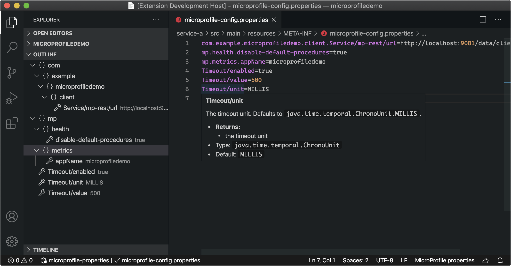

[](https://travis-ci.org/github/redhat-developer/vscode-microprofile)
[](https://marketplace.visualstudio.com/items?itemName=redhat.vscode-microprofile)
[](https://gitter.im/redhat-developer/vscode-microprofile)

# Tools for MicroProfile

## Description

This Visual Studio Code extension provides support for the development of [MicroProfile®](https://microprofile.io/)-based applications, via the [LSP4MP project](https://github.com/eclipse/lsp4mp), which consists of:

 * a [language server for MicroProfile](https://github.com/eclipse/lsp4mp/tree/master/microprofile.ls).
 * a [jdt.ls extension for MicroProfile](https://github.com/eclipse/lsp4mp/tree/master/microprofile.jdt).



## MicroProfile `properties` Features

In `microprofile-config.properties` files, you will benefit with:

  * Completion support for MicroProfile properties
  * Hover support for MicroProfile properties
  * Definition support for MicroProfile properties
  * Format support for MicroProfile properties
  * Validation and Quick Fix support for MicroProfile properties
  * Outline support (flat or tree view)

## MicroProfile `Java` Features

In `Java` files, you will benefit with:

  * Completion support for MicroProfile
  * Hover support for MicroProfile
  * Validation and Quick Fix support for MicroProfile
  * Code Lens support for MicroProfile
  * Code snippets

## Requirements

  * Java JDK (or JRE) 11 or more recent
  * [Language Support for Java(TM) by Red Hat](https://marketplace.visualstudio.com/items?itemName=redhat.java)

## Supported VS Code settings

The following settings are supported:

* `microprofile.tools.formatting.surroundEqualsWithSpaces` : Insert spaces around the equals sign when formatting the application.properties file. Default is `false`.
* `microprofile.tools.trace.server` : Trace the communication between VS Code and the MicroProfile Language Server in the Output view.
* `microprofile.tools.symbols.showAsTree` : Show MicroProfile properties as tree (Outline). Default is `true`.
* `microprofile.tools.validation.enabled` : Enables MicroProfile validation. Default is `true`.
* `microprofile.tools.validation.duplicate.severity` : Validation severity for duplicate properties for MicroProfile `*.properties` files.
Default is `warning`.
* `microprofile.tools.validation.syntax.severity` : Validation severity for property syntax checking for MicroProfile `*.properties` files.
Default is `error`.
* `microprofile.tools.validation.required.severity` : Validation severity for required properties for MicroProfile `*.properties` files.
Default is `none`.
* `microprofile.tools.validation.expression.severity` : Validation severity for property expressions for MicroProfile `*.properties` files.
Default is `error`.
* `microprofile.tools.validation.unknown.severity` : Validation severity for unknown properties for MicroProfile `*.properties` files. Default is `warning`.
* `microprofile.tools.validation.unknown.excluded` : Array of properties to ignore for unknown properties validation. Patterns can be used ('*' = any string, '?' = any character).
Default is `["*/mp-rest/providers/*/priority", "mp.openapi.schema.*", "kafka-streams.*", "camel.*"]`.
* `microprofile.tools.codeLens.urlCodeLensEnabled` : Enable/disable the URL code lenses for REST services. Default is`true`.
* `microprofile.tools.validation.value.severity`: Validation severity for property values for MicroProfile `*.properties` files. Default is `error`.

### **Note for MicroProfile Rest Client properties**:

Due to [this issue](https://github.com/redhat-developer/quarkus-ls/issues/203), the MP Rest property: `<mp-rest-client-class>/mp-rest/providers/<mp-rest-provider-class>/priority` reports an unknown error.

To avoid having this error, you must configure the following in `settings.json`:

```json
"microprofile.tools.validation.unknown.excluded": [
    "*/mp-rest/providers/*/priority"
]
```

This settings is set by default.


## Extending Tools for MicroProfile

By default, Tools for MicroProfile provides:

* Support for the `microprofile-config.properties` file (completion, validation, etc.) for the properties of MicroProfile specs (config, health, fault tolerance, etc.).
* Support in java files (diagnostics, codelens, etc.) taking into account the API of each of the MicroProfile specs.

The support for properties and java files can be extended with:

* Additional language features (diagnostics, quick fixes, etc.) in Java files for modules other than MicroProfile specs.
* Additional properties support for properties other than those defined by MicroProfile specs (Ex. Quarkus properties)
* Additional language / document selectors to allow MicroProfile language features in files other than `microprofile-config.properties` (Ex. the `application.properties` file for Quarkus)

To contribute these features, you must create a vscode-extension that declares the `microprofile` contributions in its package.json. These contributions will be picked up automatically by vscode-microprofile when it starts up the language server.

```json
"contributes": {
  "microprofile": {
    "jarExtensions": [...],
    "documentSelector": [...],
  }
}
```

### Contributing to properties and Java support

LSP4MP can be [extended](https://github.com/eclipse/lsp4mp#extensions) to support custom completion, hover, validation, etc by using the [Java Service Provider Interface (SPI)](https://www.baeldung.com/java-spi). vscode-microprofile provides the ability to use your custom lsp4mp extension by contributing external JARs to the classpath of lsp4mp.

To contribute an external JAR you must create a vscode extension which embeds your lsp4mp extension JAR and declares the path to your JAR in the extensions package.json

```json
"contributes": {
  "microprofile": {
    "jarExtensions": [
      "./jar/com.demo.custom-lsp4mp-extension.jar"
    ]
  }
}
```

For an example of how this can be used you can look at [vscode-quarkus](https://github.com/redhat-developer/vscode-quarkus) and the [quarkus-ls](https://github.com/redhat-developer/quarkus-ls) lsp4mp extension. vscode-quarkus [contributes an external jar](https://github.com/redhat-developer/vscode-quarkus/blob/f38f4caaf218cf9c6ce91e64a0d9cd632314a483/package.json#L59) which provides additional language support for quarkus properties and java files.

### Contributing to MicroProfile Language / Document Selector support

It is also possible to contribute additional document selectors which are used to register additional file types / languages with the lsp4mp language server

```json
"contributes": {
  "microprofile": {
    "documentSelector": [
      {
        "scheme": "file",
        "language": "my-custom-properties"
      }
    ]
  }
}
```

For an example of how this can be used you can look at [vscode-quarkus](https://github.com/redhat-developer/vscode-quarkus) which [contributes a document selector](https://github.com/redhat-developer/vscode-quarkus/blob/f38f4caaf218cf9c6ce91e64a0d9cd632314a483/package.json#L62) for Quarkus's `application.properties` file in order to provide MicroProfile/Quarkus properties support in this file.

## Telemetry

With your approval, vscode-microprofile extension collects anonymous [usage data](USAGE_DATA.md) and sends it to Red Hat servers to help improve our products and services.
Read our [privacy statement](https://developers.redhat.com/article/tool-data-collection) to learn more.
This extension respects the `redhat.telemetry.enabled` setting, which you can learn more about at https://github.com/redhat-developer/vscode-commons#how-to-disable-telemetry-reporting

## Contributing

This is an open source project open to anyone. Contributions are extremely welcome!

For information on getting started, refer to the [CONTRIBUTING instructions](CONTRIBUTING.md).

CI builds can be installed manually by following these instructions:

  1) Download the latest development VSIX archive [from here](https://download.jboss.org/jbosstools/vscode/snapshots/vscode-microprofile/?C=M;O=D). `(vscode-microprofile-XXX.vsix)`

  2) Click `View/Command Palette`

  3) Type 'VSIX'

  4) Select 'Install from VSIX...' and choose the `.vsix` file.

## Feedback

Please report bugs, issues and feature requests by creating a [GitHub Issue](https://github.com/redhat-developer/vscode-microprofile/issues).

## License

Apache License 2.0.
See [LICENSE](LICENSE) file.


MicroProfile® and the MicroProfile logo are trademarks of the Eclipse Foundation
