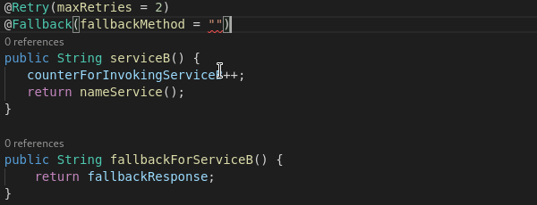
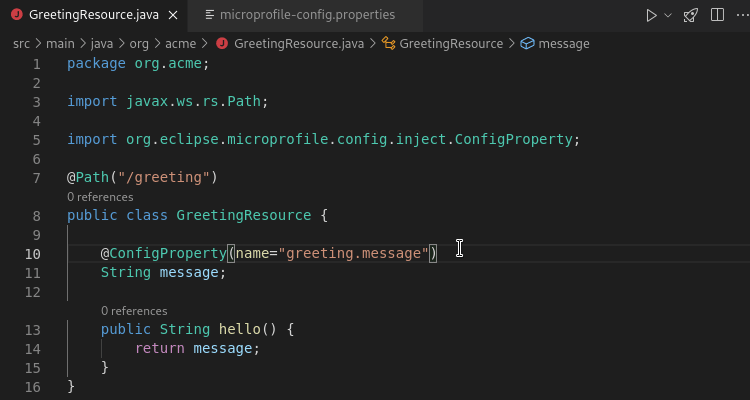
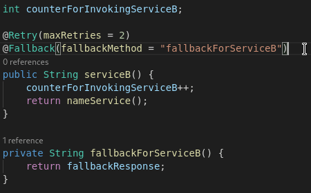
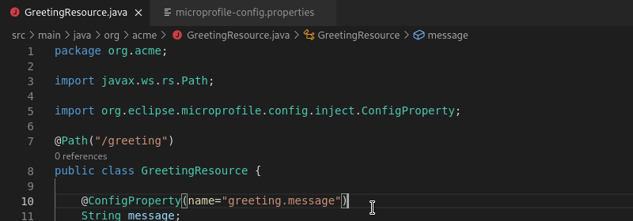
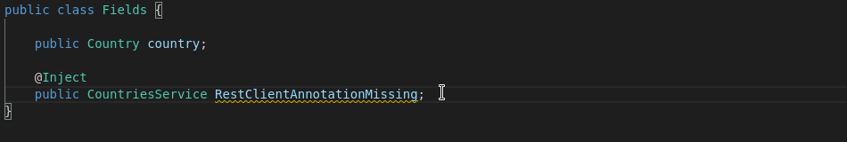
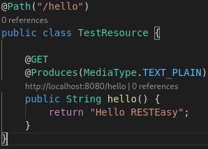

# MicroProfile Java Features

A MicroProfile project provides microservice architecture for Java applications. vscode-microprofile provides a variety of support for Java files.

## Completion support

As a main component of development with MicroProfile, annotations are used to expose APIs. For MicroProfile annotation, completion support is available using `Ctrl + Space`. An example of this is the `fallbackMethod` completion for the MicroProfile Fault Tolerance `@Fallback` annotation.

## Snippets support

In Java files in a MicroProfile project, vscode-microprofile provides the following snippets:

*  `rest_class`: Create a new JAX-RS/Jakarta REST resource class
*  `rest_get`: Create a new JAX-RS/Jakarta REST GET resource method
*  `mpreadiness`: Create a readiness check class
*  `mpliveness`: Create a liveness check class
*  `mpnrc`: Create a new MicroProfile REST client
*  `mpirc`: Inject a MicroProfile REST client
*  Snippets to help fill out the parameters for annotations that are introduced by MicroProfile:
    *  `@Timeout`
    *  `@Retry`
    *  `@Fallback`
    *  `@CircuitBreaker`
    *  `@Bulkhead`
    *  `@Metric`
    *  `@Counted`
    *  `@Gauge`
    *  `@ConcurrentGauge`
    *  `@Metered`
    *  `@Timed`
    *  `@SimplyTimed`
    *  `@RegistryType`
    *  `@Operation`
    *  `@Content`
    *  `@Schema`
    *  `@Parameters`
    *  `@Parameter`
    *  `@APIResponses`
    *  `@APIResponse`

Only snippets relevant to the context are shown.
That means that if the cursor is in a place where it doesn't make sense to add the snippet content,
or if the classes that the snippet references are on the classpath of the project,
then the snippets won't be shown.

## Hover support

Given any MicroProfile annotation, hover support is available for more info on usage, interface, etc..

An example of this is the reference to the `@ConfigProperty` annotation value defined in the project properties file.

## Navigation support

For any reference to a local definition of an annotation value, `Ctrl + Click` will navigate to the value definition.

Similarly, there is navigation support for any `microprofile-config.properties` definition referenced in the Java project also using `Ctrl + Click`.

## Validation and Quick Fix support

Diagnostics are supported for MicroProfile annotations which targets errors and warnings that would thrown on runtime. Most of these diagnostics also have an associated quick fix to triage the diagnostic.

## CodeLens support

On debug, a Quarkus application run with MicroProfile sources supports a URL CodeLens that routes to the endpoint debug path.

## Workspace Symbols support

vscode-microprofile provides workspace symbols for:

### Jakarta/JAX-RS REST methods

Workspace Symbols with the prefix `@` refer to Jakarta/JAX-RS REST methods.
vscode-microprofile lists the URL and the HTTP method for each method.

