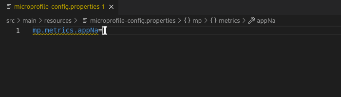

# MicroProfile Properties Features

A MicroProfile project can be configured using a `microprofile-config.properties` file. vscode-microprofile provides a variety of support for `microprofile-config.properties` files.

These features are made available given a "Microprofile properties" file has been detected.


These features are also supported for a user profile on the [config level](https://download.eclipse.org/microprofile/microprofile-config-2.0/microprofile-config-spec-2.0.html#_on_config_source_level) and the [property level](https://download.eclipse.org/microprofile/microprofile-config-2.0/microprofile-config-spec-2.0.html#_on_property_level). For example, a file such as `microprofile-config-prod.properties` will have feature support in relation to the `prod` profile.

## Completion support

Depending on the extensions installed for the project, the property autocomplete feature lists suggested properties based on the text entered and extensions available.


Value completion is also supported for each property.

### Read more

You can find out more on the available extensions and the completion supported for your MicroProfile project version at microprofile.io.

## Hover support

For any given supported property defined in `microprofile-config.properties`, hovering the property will list details about the property, including type, associated extension and assigned value, if any.


## Definition support

### Java file definition

If a property value is configured in `microprofile-config.properties`, `Ctrl + Click` of the property will jump to the Java file declaration.


### Properties definition

If a property value is defined using a [property expression](https://download.eclipse.org/microprofile/microprofile-config-2.0/microprofile-config-spec-2.0.html#property-expressions) (i.e. `${}`) which references another property defined in `microprofile-config.properties`, `Ctrl + Click` of the property expression value will jump to the property definition.


## Format support

A "Microprofile properties" file sets the default formatter to "Tools for MicroProfile", so the formatting shortcut for a `microprofile-config.properties` file is `Ctrl + Shift + I`. The formatter can also be accessed from the command palette and right-click dropdown.


## Validation and Quick Fix support

For any supported property that can be defined in a "Microprofile properties" file, there is validation for the property name and a quick fix action to correct the diagnostic.



## Outline support

Given the following `microprofile-config.properties` file:

```properties
mp.metrics.appName=foo
mp.metrics.tags=bar
```

With the `microprofile.tools.symbols.showAsTree` setting enabled:


The property hierarchy can be viewed from the "Outline" tab.


